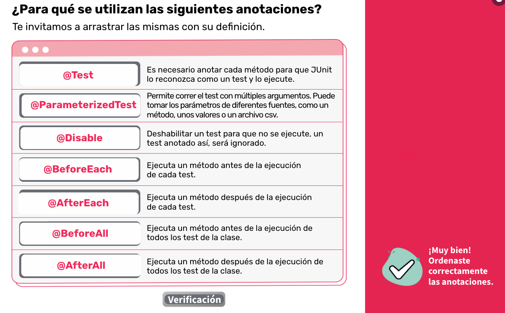

# Backend1
Notas de la materia Backen del programa CTD dictado por Digital House.

## Modulo 1

### Clase 1
#### Material:</br>
<h3>Que es backend1?</h3>
Es la parte del sitio o aplicación con la que los usuarios no tienen contacto, sin embargo, resulta una parte fundamental de cualquier aplicación. Si está leyendo este texto, por ejemplo, es una señal de que la comunicación con el servidor fue exitosa y esto probablemente se deba al buen trabajo del programador back-end.

<h3>JUnit</h3>
Nos permite generalizar lo que sucede en cada test, utilizando las siguientes anotaciones.</br>

```java
import org.juint.jupiter.api.Test*;
import static org.junit.jupiter.api.Assertions.*;

class AssertionsTest{
    @Test
    void standardAssertions(){
        assertEquals(2,2); //--> evalua si son iguales
        assertTrue(edad == 2, "Son iguales los numeros?"); //-->evalua si es verdadera la cuestion

    }
}

    @Rule public ExpectedException thrown= ExpectedException.none();

    @Test 
    public void myTest(){
        thrown.expect(Exception.class);
        thrown.expectMessage("Init Golf must be >= 0");
        rodgers = new Pirate("Dread Pirate Rodgers", -100);
    }

```

Con los test de integracion nos asegurmos que los diferentes flujos de codigo funcionan correctamente. </br>
Tests unitarios y de integración, necesitamos saber si nuestro sistema cumple con las especificaciones o mejorar una parte de código.


Assertions
- assertArrayEquals
- assertEquals
- assertTrue and assertFalse
- assertNull and assertNotNull
- assertSame and assertNotSame
- assertAll
- assertNotEquals
- assertIterableEquals
- assertThrows
- assertTimeout and assertTimeoutPreemptively
- assertLinesMatch
#### Notas Clase:</br>

## Modulo n

## Clase n
#### Material:</br>

#### Notas Clase:</br>