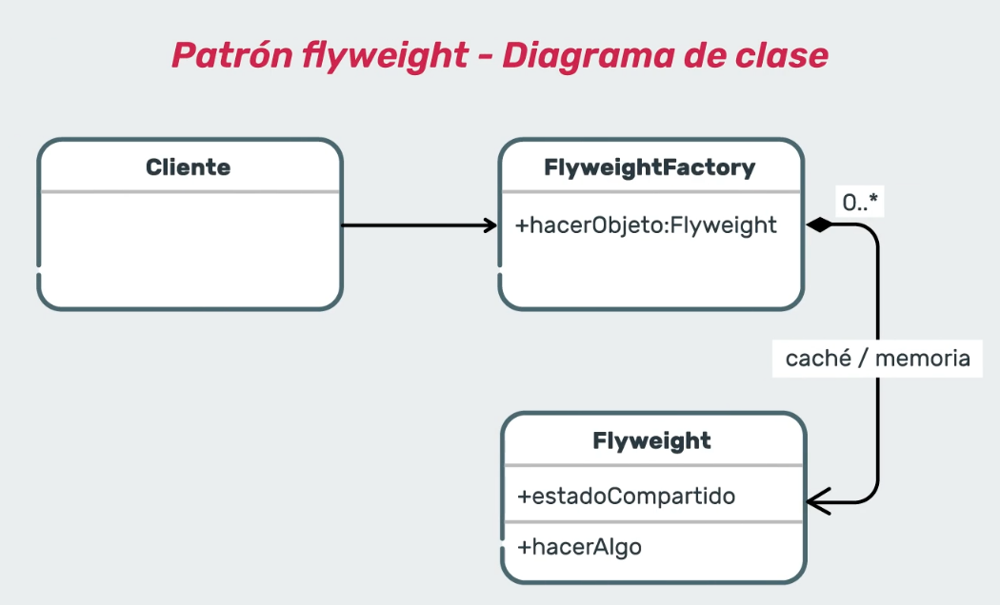

# Backend I

Estado: Cursando --> Revisar material faltante 

# Notas de clases y mesas

## Clase 1

Notas de material

- ***Que es backend1?***
    
    Es la parte del sitio o aplicación con la que los usuarios no tienen contacto, sin embargo, resulta una parte fundamental de cualquier aplicación. Si está leyendo este texto, por ejemplo, es una señal de que la comunicación con el servidor fue exitosa y esto probablemente se deba al buen trabajo del programador back-end.
    
- ***Introducción a JUnit***
    
    Nos permite generalizar lo que sucede en cada test, utilizando las siguientes anotaciones.
    
    ```java
    import org.juint.jupiter.api.Test*;
    
    import static org.junit.jupiter.api.Assertions.*;
    
    class AssertionsTest{
    
    	@Test
    
    	void standardAssertions(){
    
    		assertEquals(2,2); *//--> evalua si son iguales*
    
    		assertTrue(edad == 2, "Son iguales los numeros?"); *//-->evalua si es verdadera la cuestion*
    
    	 }
    
    }
    
    @Rule public ExpectedException thrown= ExpectedException.none();
    
    @Test
    
    public void myTest(){
    
    	thrown.expect(Exception.class);
    
    	thrown.expectMessage("Init Golf must be >= 0");
    
    	rodgers = *new* Pirate("Dread Pirate Rodgers", -100);
    
    }
    ```
    
    Con los test de integración nos aseguramos que los diferentes flujos de código funcionan correctamente.
    
    Tests unitarios y de integración, necesitamos saber si nuestro sistema cumple con las especificaciones o mejorar una parte de código.
    
    //imagen
    
    - Assertions
        - assertArrayEquals
        - assertEquals
        - assertTrue and assertFalse
        - assertNull and assertNotNull
        - assertSame and assertNotSame
        - assertAll
        - assertNotEquals
        - assertIterableEquals
        - assertThrows
        - assertTimeout and assertTimeoutPreemptively
        - assertLinesMatch
- ***Tests Unitarios***

- ***JUnit***


Notas de clase

```java
//Primero importamos los test 
y creamos una clase con ...Test
y hacemos 
@Test 
public void probarMayrEdad(){
        //se crean las personas a probar
        Persona persona1 = new Persona("Delfina", 15);
        Persona persona2 = new Persona("Lara", 21);

        //Pruebas
        Assertions.assertTrue(persona2.esMayorDeEdad(), "La persona 2 es mayor de edad");
        Assertions.assertFalse(persona1.esMayorDeEdad(), "La persona 1 es menor de edad");
    }
```

## Clase 2

Notas de material

- ***Patrón Template Method***
    
    //imagenes x2
    
    ### Ventajas
    
    - Los clientes pueden sobrescribir ciertas partes de un algoritmo grande para que le safecten menos los cambios que tienen lugar en otras partes
    - Se puede colocar código duplicado dentro de una superclase
    
    ### Desventajas
    
    - Posee un alto grado de dependencia en la interfaz de la fachada
    - Algunos clientes pueden verse limitados por el esqueleto proporcionado por el algoritmo
    
    ### Ejemplo
    
    [Backend%20I%205c88e9bc8b164c06811f1ce0858d6da5/Ejemplo_de_Patrn_Template_Method.pdf](Backend%20I%205c88e9bc8b164c06811f1ce0858d6da5/Ejemplo_de_Patrn_Template_Method.pdf)
    
    
Notas de clase
Ejercicio de la mesa se encuentra en la carpta correspondiente.

## Clase 3 - Integradora I

Notas de clase
Ejercicio de la mesa se encuentra en la carpta correspondiente.

## Clase 4

Notas de material

- ***Patrón cadena de responsabilidad***
    
    //imagen
    
    //imagen
    
    ### Ventajas
    
    - Mayor flexibilidad para procesar las peticiones del cliente. Es posible agregar objetos que sepan resolver nuevas responsabilidades o modificar las actuales sin afectar al cliente.
    - Menor acoplamiento. Permite que un objeto envíe una petición y sepa que va a ser tratada, pero tanto el emisor como el receptor no conocen nada del otro.
    
    ### Desventajas
    
    - Puede ser complejo implementar la cadena, y si no está bien configurada, puede que no se cubran todas las peticiones.
    
    ### Ejemplo
    
    [Backend%20I%205c88e9bc8b164c06811f1ce0858d6da5/Ejemplo_Cadena_de_Responsabilidad.pdf](Backend%20I%205c88e9bc8b164c06811f1ce0858d6da5/Ejemplo_Cadena_de_Responsabilidad.pdf)
    

Notas de clase
Ejercicio de la mesa se encuentra en la carpta correspondiente.

## Clase 5

Notas de material

- ***Patrón Proxy***
AGREGAR ANOTACIONES 

Notas de clase
Trabajamos sobre un proyecto de paginas bloqueadas y en la mesas sobre un proyecto de Spotify (usuarios Free y Premium que tienen permitido descargar canciones).

## Clase 6 - Integradora II

Notas de clase
Hacemos un repaso de los patros vistos esta semana y la actividad de un repaso del patron proxy. El ej se encuentra resuelto en la carpeta de la clase correspondiente.

## Clase 7

Notas de material
- ***Patron Flyweight***
    --> menos instancias y decoracion 
    Patron de tipo estructural
    Bajo uso de memoria, en vez de crear nuevo sobjetos los guarda en cache y lo logra reutilizando objetos creados en otras instancias. 
    El cliente: objeto que dispara la ejecucion. 
    Flyweight factory: fabrica de objetos ligeros
    Flyweight: objetos a reutilizar 
    


Notas de clase

## Clase 8

Notas de material
- ***Patron Facade***
    Patron estructural
    Ventajas:
    - software mas flexible y facil de expandir
    - Menos uso de objetos que tratan con el cliente
    - reducimos el acoplamiento entre el clientey los subsistemas.
    Desventaja:
    - Alto grado de dependencia en la interfaz de la fachada.
Notas de clase

## Clase 9- integradora
Notas de material

Notas de clase

## Clase 10
Notas de material
- ***¿Qué es Log4j?***
Es una libreria de Java utilizada para generar mensajes de logging de una forma limpia, sencilla, permitiendo filtrarlos por importancia y pudiendo configurar su salida tanto por consola, fichero u otras diferentes. </br>
Ventajas: Permite tener un registro de lo que está pasando en nuestros sistemas, lo que nos posibilita entender mejor los errores.</br>
Desventajas:La única desventaja es que a veces los archivos se hacen muy grandes y ocupan mucho espacio. Es por ello que debemos elegir bien qué tipo de información queremos almacenar.</br>


- Niveles de registro
Por defecto Log4j tiene niveles de prioridad para los mensajes, entre ellos se encuentran:
     - OFF: Este es el nivel de mínimo detalle, deshabilita todos los logs.
    - FATAL: Se utiliza para mensajes críticos del sistema, generalmente después de guardar el mensaje, el programa se cierra.
    - ERROR: Indica eventos de error que aún podrían permitir que la aplicación continúe ejecutándose.
    - WARN: Se utiliza para mensajes de alerta sobre eventos.
    - INFO: Se refiere a mensajes informativos que resaltan el progreso de la aplicación en un nivel aproximado.
    - DEBUG: Designa los eventos informativos detallados más útiles para depurar una aplicación.
    - TRACE: Se utiliza para mostrar mensajes con un mayor nivel de detalle que debug.
    - ALL: Es el nivel de máximo detalle, habilita todos los logs.

Notas de clase
//Ver instalacion de log4j
//ver practica logging

## Clase 11
Notas de material

Notas de clase

## Clase 12
Notas de material

Notas de clase

## Clase  13
Notas de material

Notas de clase